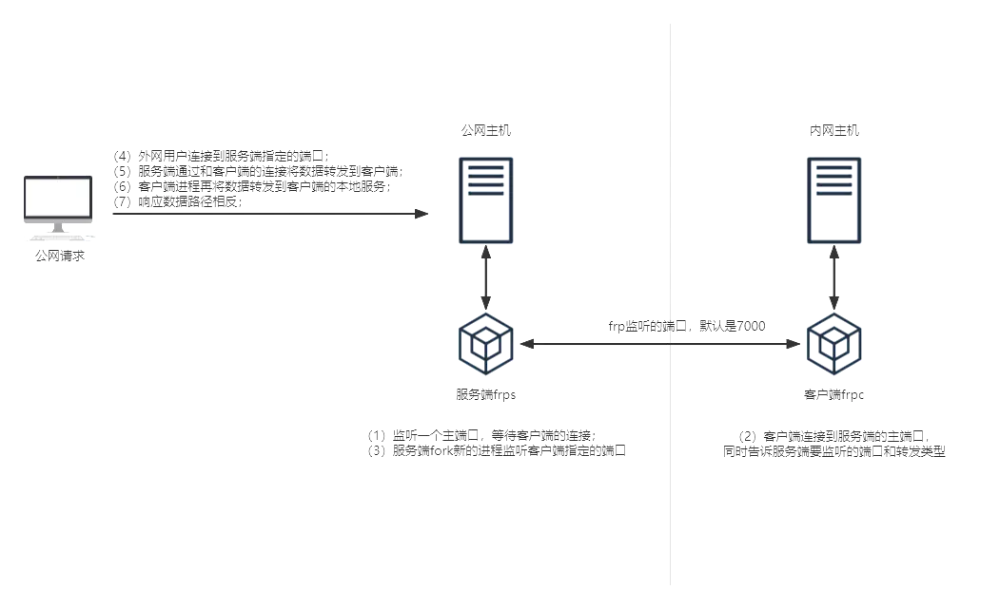

> 背景：
>
> 工作和在家学习时会用到很多中间件，想要一个稳定的开发环境，直接买个32G内存的服务器太贵了，所以买了迷你主机装了Ubuntu当做服务器，那就需要解决外网访问问题，这里就涉及到内网穿透。
>
> 内网穿透方式：
>
> - 自建：[frp](https://gofrp.org/zh-cn/docs/)（推荐），[localhost.run](http://localhost.run/)，[gost](https://github.com/ginuerzh/gost)，[nps](https://ehang-io.github.io/nps/#/?id=nps)
> - 购买：花生壳，[pubyun](http://www.pubyun.com/)，[ngrok](https://www.ngrok.cc/)，[路由侠](https://www.luyouxia.com/)
>
> 准备：一台Ubuntu系统主机，一台有公网IP的主机

## 1. frp工作原理





## 2. frp压缩包文件说明

1. [下载frp文件包](https://github.com/fatedier/frp/releases/download/v0.61.0/frp_0.61.0_linux_amd64.tar.gz)  
2. [frp文档](https://gofrp.org/zh-cn/docs)

每个压缩包解压后都包含以下文件和一个systemd文件夹：

- frpc —— 客户端可执行二进制文件
- frpc.toml —— 客户端使用的配置文件，包含最简配置
- frps —— 服务端可执行二进制文件
- frps.toml —— 包含全部配置项的服务端配置文件

注：服务端（外网）只需用到frp_0.61.0_linux_amd64目录下的frps相关文件，客户端（内网）只需用到frp_0.61.0_linux_amd64目录下的frpc相关文件

## 3. 服务端配置(公网服务器)

### 3.1 解压

```bash
# 切换目录
mkdir -r /data/frp

cd /data/frp

# 解压
tar -zxvf frp_0.61.0_linux_amd64.tar.gz

# 编辑配置文件，注意是 frps
vim /data/frp/frp_0.61.0_linux_amd64/frps.toml
```

### 3.2 配置文件

```sh
# 监听的端口，默认是7000
bindPort = 10001

# http 穿透端口
vhostHTTPPort = 9996
# https 穿透端口
vhostHTTPSPort = 9997

# token在客户端会用到,客户端frpc和服务端frps配置文件中配置相同的token
auth.token = "token2333"

# 后台管理: 界面 http://[server addr]:9998 访问 Dashboard 
# 默认为 127.0.0.1，如果需要公网访问，需要修改为 0.0.0.0
webServer.addr = "0.0.0.0"
# 后台管理: 端口
webServer.port = 9998
# 后台管理: 用户名和密码
webServer.user = "user1"
webServer.password = "pwd123"

# frp日志配置
log.to = "/data/logs/frp/frps.log"
log.level = "info"
log.maxDays = 7

```

### 3.3 启动服务端
**使用 systemd 来管理 frps 服务，包括启动、停止、配置后台运行和设置开机自启动。**

1.创建frps.service文件：
```shell
# 编辑文件
vim /etc/systemd/system/frps.service

######## 配置内容 ########
# 服务端开启自启：
[Unit]
# 服务名称，可自定义
Description = frps server
After = network.target syslog.target
Wants = network.target

[Service]
Type = simple
# 启动frps的命令，需修改为您的frps的安装路径
ExecStart = /data/frp/frp_0.61.0_linux_amd64/frps -c /data/frp/frp_0.61.0_linux_amd64/frps.toml

[Install]
WantedBy = multi-user.target
```
2.赋予权限：

```shell
chmod 775 /etc/systemd/system/frps.service

```


3.操作命令：
```shell
# 刷新配置
systemctl daemon-reload  

# 启动frp
sudo systemctl start frps

# 停止frp
sudo systemctl stop frps

# 重启frp
sudo systemctl restart frps

# 查看frp状态
sudo systemctl status frps

# 设置 frps 开机自启动
sudo systemctl enable frps
```


## 4. 客户端配置(内网服务器)

### 4.1 解压

```bash
# 切换目录
mkdir -r /data/frp

cd /data/frp

# 解压
tar -zxvf frp_0.61.0_linux_amd64.tar.gz

# 编辑配置文件，注意是 frpc
vim /data/frp/frp_0.61.0_linux_amd64/frpc.toml
```

### 4.2 编辑配置文件

```sh
# 公网服务器ip
serverAddr = "120.xxx.xxx.xxx"
# 公网服务端通信端口
serverPort = 10001   
# 令牌，与公网服务端保持一致
auth.token = "token2333"

# 日志相关
log.to = "/data/logs/frp/frps.log"
log.level = "info"
log.maxDays = 7

# 通过 SSH 访问内网机器， frp将请求发送到x.x.x.x:10000的流量转发到内网机器的 22 端口
[[proxies]]
name = "ssh"
type = "tcp"
localIP = "192.168.100.5"
localPort = 22
# 指明由公网服务器的10000端口代理
remotePort = 10000


[[proxies]]
name = "mysql"
type = "tcp"
localIP = "192.168.100.5"
localPort = 3306
remotePort = 3306


# 添加web节点
#[[proxies]]  
#name = "web"
#type = http
# 本地8080端口可以通公网服务器7002端口访问
#localPort = 8180
# 自定义子域名
#customDomains = ["120.xxx.xxx.xxx"]

```


### 4.3 启动客户端

**使用 systemd 来管理 frps 服务，包括启动、停止、配置后台运行和设置开机自启动。**

1.创建frpc.service文件：
```shell
# 编辑文件
vim /etc/systemd/system/frpc.service

######## 配置内容 ########
[Unit]
# 服务名称，可自定义
Description = frpc server
After = network.target syslog.target
Wants = network.target

[Service]
Type = simple
Restart=on-failure
RestartSec=5s
# 启动frpc的命令，需修改为您的frpc的安装路径
ExecStart = /data/frp/frp_0.61.0_linux_amd64/frpc -c /data/frp/frp_0.61.0_linux_amd64/frpc.toml
ExecReload = /data/frp/frp_0.61.0_linux_amd64/frpc reload -c /data/frp/frp_0.61.0_linux_amd64/frpc.toml

[Install]
WantedBy = multi-user.target

```
2.赋予权限：
```shell
chmod 775 /etc/systemd/system/frpc.service
```

操作命令:
```shell
# 刷新配置
systemctl daemon-reload  

# 启动frp
systemctl start frpc

# 停止frp
systemctl stop frpc

# 重启frp
systemctl restart frpc

# 查看frp状态
systemctl status frpc

# 设置 frps 开机自启动
systemctl enable frpc
```

## 5. 重要：避开以下端口

```java
1, // tcpmux
7, // echo
9, // discard
11, // systat
13, // daytime
15, // netstat
17, // qotd
19, // chargen
20, // ftp data
21, // ftp access
22, // ssh
23, // telnet
25, // smtp
37, // time
42, // name
43, // nicname
53, // domain
77, // priv-rjs
79, // finger
87, // ttylink
95, // supdup
101, // hostriame
102, // iso-tsap
103, // gppitnp
104, // acr-nema
109, // pop2
110, // pop3
111, // sunrpc
113, // auth
115, // sftp
117, // uucp-path
119, // nntp
123, // NTP
135, // loc-srv /epmap
139, // netbios
143, // imap2
179, // BGP
389, // ldap
465, // smtp+ssl
512, // print / exec
513, // login
514, // shell
515, // printer
526, // tempo
530, // courier
531, // chat
532, // netnews
540, // uucp
556, // remotefs
563, // nntp+ssl
587, // stmp?
601, // ??
636, // ldap+ssl
993, // ldap+ssl
995, // pop3+ssl
2049, // nfs
3659, // apple-sasl / PasswordServer
4045, // lockd
6000, // X11
6665, // Alternate IRC [Apple addition]
6666, // Alternate IRC [Apple addition]
6667, // Standard IRC [Apple addition]
6668, // Alternate IRC [Apple addition]
6669, // Alternate IRC [Apple addition]
```
