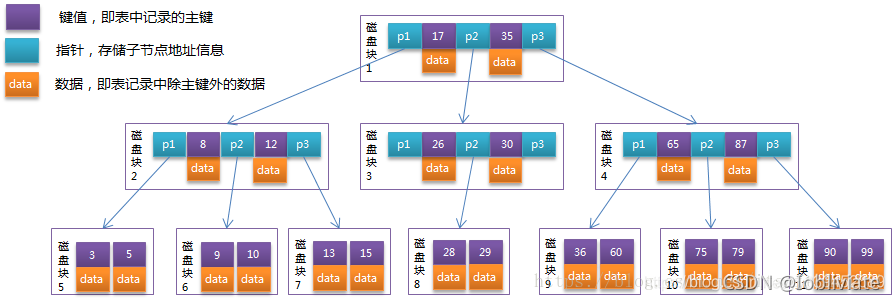
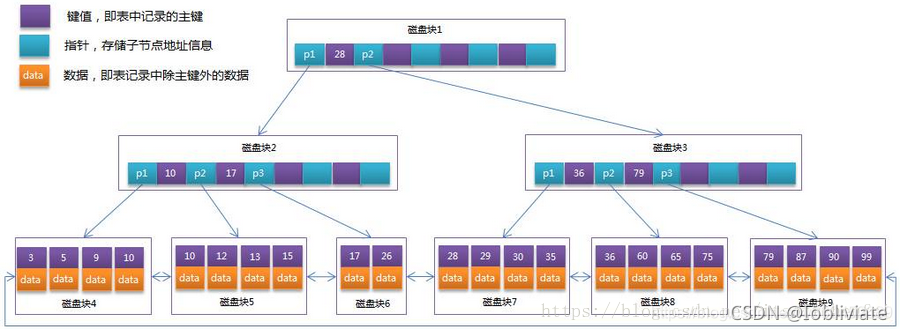

## B-Tree
B-树是一种多路自平衡的搜索树，它类似普通的平衡二叉树，不同的一点是B-树允许每个节点有更多的子节点。

B-Tree相对于AVLTree缩减了节点个数，使每次磁盘I/O取到内存的数据都发挥了作用，从而提高了查询效率。

注：**B-Tree就是我们常说的B树**
那么m阶B-Tree是满足下列条件的数据结构：
- 所有键值分布在整棵树中
- 搜索有可能在非叶子节点结束，在关键字全集内做一次查找，性能逼近二分查找
- 每个节点最多拥有m个子树
- 根节点至少有2个子树
- 分支节点至少拥有m/2颗子树（除根节点和叶子节点外都是分支节点）
- 所有叶子节点都在同一层，每个节点最多可以有m-1个key，并且以升序排列

每个节点占用一个磁盘块，一个节点上有两个升序排序的关键字和三个指向子树根节点的指针，指针存储的是子节点所在磁盘块的地址。

两个关键词划分成的三个范围域对应三个指针指向的子树的数据的范围域。 以根节点为例，关键字为17和35，P1指针指向的子树的数据范围小于17，
P2指针指向的子树的数据范围为17~35，P3指针指向的子树的数据范围大于35.

模拟查找关键字29的过程：
1. 根据根节点找到磁盘块1，读入内存。【磁盘I/O操作第1次】
2. 比较关键字29在区间（17,35），找到磁盘块1的指针P2。
3. 根据P2指针找到磁盘块3，读入内存。【磁盘I/O操作第2次】
4. 比较关键字29在区间（26,30），找到磁盘块3的指针P2。
5. 根据P2指针找到磁盘块8，读入内存。【磁盘I/O操作第3次】
6. 在磁盘块8中的关键字列表中找到关键字29。
7. 分析上面过程，发现需要3次磁盘I/O操作，和3次内存查找操作。由于内存中的关键字是一个有序表结构，可以利用二分法查找提高效率。而3次磁盘I/O操作是影响整个B-Tree查找效率的决定因素。

**同时B-Tree也存在问题：**

每个节点中有key，也有data，而每一个页的存储空间是有限的，如果data数据较大时将会导致每个节点（即一个页）能存储的key的数量很小。

当存储的数据量很大时同样会导致B-Tree的深度较大，增大查询时的磁盘I/O次数，进而影响查询效率

## B+Tree

B+Tree是在B-Tree基础上的一种优化，InnoDB存储引擎就是用B+Tree实现其索引结构。它带来的变化点：

B+树每个节点可以包含更多的节点，这样做有两个原因:
- 一个是降低树的高度
- 另外一个是将数据范围变为多个区间，区间越多，数据检索越快，非叶子节点存储key，叶子节点存储key和数据，叶子节点两两指针相互链接（符合磁盘的预读特性），顺序查询性能更高

注：MySQL的InnoDB存储引擎在设计时是将根节点常驻内存，因此力求达到树的深度不超过3，也就是说I/O不需要超过3次。

通常在B+Tree上有两个头指针，一个指向根节点，另一个指向关键字最小的叶子节点，而且所有叶子节点（即数据节点）之间是一种链式环结构，

因此可以对B+Tree进行两种查找运算：一种是对于主键的范围查找的分页查找，另一种是从根节点开始，进行随机查找。

## B-树和B+树的区别
- B+树内节点不存储数据，所有数据存储在叶节点导致查询时间复杂度固定为log n
- B-树查询时间复杂度不固定，与Key在树中的位置有关，最好为O(1)
- B+树叶节点两两相连可大大增加区间访问性，可使用在范围查询等
- B+树更适合外部存储（存储磁盘数据）。由于内节点无data域，每个节点能索引的范围更大更精确。