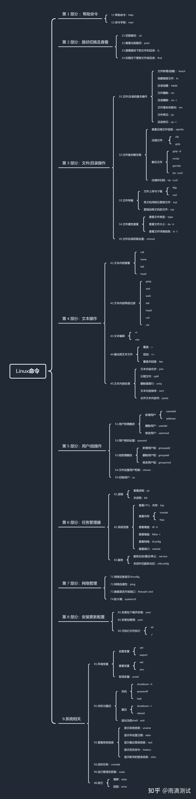

## 日志排查

```shell :collapsed-lines=20
# 实时滚动日志 -f：循环读取， -n：显示行数
tail -fn 100 server.log | grep -a '关键字' -C 10

# -A：查询后10行， -B：查询前10行， -C：查询前后10行
cat server.log | grep "关键字" -A 10

# 显示3000~3999行
cat server.log | tail -n  3000 | head -n 1000

# 按时间段提取日志
sed -n '/2023-01-12 11:30:00/,/2023-01-12 11:40:00/p'  groupmsg-server.log > debug20230112.log

# 计算出日志文本出现的次数 wc -l:统计行数；wc -c:统计字节数；wc -m统计字符数；wc -w 统计字数
grep '关键字' dalitest1.txt | wc -l

# 在当前文件夹内查询所有log
grep '关键字' *.log

# 反向匹配, 查找不包含xxx的内容
grep -v xxx

# 排除所有空行
grep -v '^/pre>

# 查询以abc开头的行
grep -n “^abc” 111.txt 

```


## find
```shell :collapsed-lines=20
# 查找目录：
find /home/data -name 'mysql' -type d 

# 在目录下找后缀是.mysql的文件
find /home/data -name '*.mysql' -print

# /home目录下查找以.txt结尾的文件名，忽略大小写
find /home -iname "*.txt"

# 当前目录及子目录下查找所有以.txt和.pdf结尾的文件
find . -name "*.txt" -o -name "*.pdf"

############ 根据文件类型进行搜索 ############
#类型参数列表：
f 普通文件
l 符号连接
d 目录
c 字符设备
b 块设备
s 套接字
p Fifo

# 向下最大深度限制为3
find . -maxdepth 3 -type f

# 搜索出深度距离当前目录至少2个子目录的所有文件
find . -mindepth 2 -type f

############ 根据文件大小进行搜索 ############
#文件大小单元：
b —— 块（512字节）
c —— 字节
w —— 字（2字节）
k —— 千字节
M —— 兆字节
G —— 吉字节

#搜索大于10KB的文件
find . -type f -size +10k

#搜索小于10KB的文件
find . -type f -size -10k

#删除当前目录下所有.txt文件
find . -type f -name "*.txt" -delete

# 找出当前目录用户tom拥有的所有文件， -user为用户，-group为群组
find . -type f -user tom

# 列出所有长度为零的文件
find . -empty
```

## rz、sz

当前操作服务器视角：
- rz: receive zmodem的缩写，当前服务器接受文件，从本地选择文件上传到Linux服务器。
- sz: send zmodem的缩写，当前服务器发送文件，从Linux下载到Windows系统

```shell
#red系安装
yum install -y lrzsz

# debian系
apt install -y lrzsz
```

## tar解压

```shell :collapsed-lines=20
# （1）解压tar.gz和tar包到当前目录
tar -xvf test.tar.gz
tar -xvf test.tar 

# （2）解压到指定目录
tar -xvf test.tar.gz -C dir
tar -xvf test.tar -C dir

# （3）解压包中指定的文件
# 如果只需要解压出log目录下的1111.log
tar -xvf test.tar.gz log/1111.log
# 将1.log解压到test目录
tar -xvf test.tar.gz log/1111.log -C test 

# （4）解压时去掉目录结构
# 如果只想要压缩包的文件，可以去掉目录结构（注意：同一文件夹下文件名不能重）：
tar -xvf test.tar.gz --strip-components=1 #去掉一层目录

-c 建立新的压缩文件
-r 添加文件到已经压缩的文件
-u 添加改变了和现有的文件到已经存在的压缩文件
-x 从压缩的文件中提取文件
-t 显示压缩文件的内容
-z 支持gzip解压文件
-j 支持bzip2解压文件
-v 显示操作过程
-k 保留源有文件不覆盖
-C 切换到指定目录
-f 指定压缩文件

--delete            删除包中文件
--strip-components  去除目录
--add-file          向包中添加文件
```

## tar压缩

压缩率：tar.bz2 > tar.gz > zip > tar
```shell :collapsed-lines=20
#（1）归档tar包，不压缩，由于这种方式不会进行压缩，仅做了归档，因此速度极快，同时占用空间也较大
# 1.归档多个文件
tar -cvf test.tar test1.log test2.log  
# 2.归档test目录下所有文件
tar -cvf test.tar test/*  
# 3.归档所有以.log结尾的文件 
tar -cvf test.tar *.log  

#（2）归档并压缩为tar.gz或tar.bz2
# 1.打包，并以gzip压缩
tar -zcvf test.tar.gz file1 file2 
# 2.打包，并以bzip2压缩
tar -jcvf test.tar.bz2 file1 file2 

#（3）查看压缩包中的文件
# 使用-t参数可查看test包中有哪些文件
tar -tvf test.tar 

#（4）打包后删除源文件
# 使用--remove-files 删除源文件
tar -zcvf test.tar.gz test.log --remove-files 

#（5）打包除指定目录或文件以外的文件
#打包test目录下所有文件，排除以.log结尾的文件，使用--exclude选项排除一些不需要打包的文件：
tar -zcvf test.tar.gz --exclude=test/*.log test/* 

#（6）向压缩包中更新文件
#压缩包中已经打入了test以及其他文件，现在你只想更新压缩包中的test文件，那么你可以使用--add-file选项：
tar -tf test.tar --add-file=test #只针对tar包

#（7）向tar包中增加文件
# 向tar包中增加文件可使用-r参数：在test.tar包中增加文件，只针对tar包
tar -rf test.tar testfile 


#（8）删除压缩包中的文件
# 在不解压的情况下，可使用--delete选项删除包中的文件：
tar --delete -f test.tar  test1 #从test.tar中删除test1文件

-c 建立新的压缩文件
-r 添加文件到已经压缩的文件
-u 添加改变了和现有的文件到已经存在的压缩文件
-x 从压缩的文件中提取文件
-t 显示压缩文件的内容
-z 支持gzip解压文件
-j 支持bzip2解压文件
-v 显示操作过程
-k 保留源有文件不覆盖
-C 切换到指定目录
-f 指定压缩文件

--delete            删除包中文件
--strip-components  去除目录
--add-file          向包中添加文件
```

## unzip解压
```shell :collapsed-lines=20
#（1）查看压缩包中的文件信息
unzip -l test.zip #可以看到压缩包中的文件名，日期等信息
unzip -v test.zip #查看更多信息，例如crc校验信息等

#（2）解压压缩包
# -d 指定目录
unzip -o test.zip -d dir #讲test.zip解压到dir目录

#（3）解压包中指定的文件
unzip -o test.zip "1.log" -d dir #解压包中的1.log文件到dir目录
unzip -o tet.zip "*.log" -d dir  #解压包中所有的log文件

#（4）解压时去掉目录结构
#只想要压缩包中的文件，可以使用-j参数:
zip -oj test.zip -d ./temp  

#（5）解压jar包
#jar包是java归档包，但同样可用unzip解压查看里面的文件：
unzip -o java.jar -d dir

解压参数：
-l 显示压缩文件内所包含的文件
-j 只保存文件名称及其内容，而不存放任何目录名称。
-o 以压缩文件内拥有最新更改时间的文件为准，将压缩文件的更改时间设成和该
-v 显示指令执行过程或显示版本信息。
-d 指定解压目录，目录不存在会创建

```


## zip压缩
压缩率：tar.bz2 > tar.gz > zip > tar
```shell :collapsed-lines=20
#（1）压缩文件
zip -r test.zip test/ #打包test目录下的文件
zip -rj test.zip test/ #打包test目录下文件，且压缩包不带test目录

#（2）指定压缩率打包文件
zip -r8 test.zip test/* #数值（1-9）越大，压缩率越高，耗时越长

#（3）打包符号链接文件
#前面的命令只能打包普通文件，如果想要打包符号链接文件，则需要使用参数-y：
zip  -ry test.zip test

#（4）向压缩包中增加或更新文件
zip -u test.zip test2 #向test.zip 包中增加test2文件

#（5）压缩时加密
#可使用-P参数对压缩包进行加密
zip -r test.zip test1 test -P 66666 #使用密码66666加密

#（6）删除压缩包的特定文件
zip -d test.zip test  #删除test.zip包中的test文件

压缩参数：
-d 从压缩文件内删除指定的文件。
-f 此参数的效果和指定"-u"参数类似，但不仅更新既有文件，如果某些文件原本不存在于压缩文件内，使用本参数会一并将其加入压缩文件中。
-j 只保存文件名称及其内容，而不存放任何目录名称。
-r 递归处理，将指定目录下的所有文件和子目录一并处理。
-u 更换较新的文件到压缩文件内。
-v 显示指令执行过程或显示版本信息。
-y 直接保存符号连接，而非该连接所指向的文件，本参数仅在UNIX之类的系统下有效。
- <压缩效率> 压缩效率是一个介于1-9的数值。
```


## gzip解压缩

```shell :collapsed-lines=20
# （1）压缩
# 使用-k参数保留源文件：
gzip -k ./* #当前目录下所有文件进行压缩，每个文件一个gz包
gzip -rkv ./* 递归压缩

# （2）解压
gzip -dv test.gz

-k 保留源文件
-d 解开压缩文件
-r 递归处理，将指定目录下的所有文件及子目录一并处理
-v 显示指令执行过程
```
## 端口被占用
```shell
查看被占用端口pid
lsof -i:8000

查看所有端口
netstat -ntlp

ps aux | grep PID
```


## 查看磁盘占用
```shell :collapsed-lines=20
#查看总的占用率
df -h  

#1、查看当前目录总共占的容量，而不单独列出各子项占用的容量 
du -sh

#2、查看当前目录下一级子文件和子目录占用的磁盘容量
du -lh --max-depth=1

#3、统计当前文件夹(目录)大小，并按文件大小排序：
du -sh * | sort -n

#4、查看指定文件大小可以使用du -sh或du -a：
du -sh installmongofor3.6.log

#5、列出当前目录中的目录名不包括某字符串的目录的总大小：
du -sh --exclude='installmongofor3.6.log'

# 查看指定目录
df -h /usr/

# 具体查看文件夹的占用情况
du --max-depth=1 -h

# 计算文件夹大小
du -sh /usr/

# 查看磁盘挂载情况
mount

# 查看目录及子目录大小
du -H -h

-a或-all 显示目录中个别文件的大小。
-b或-bytes 显示目录或文件大小时，以byte为单位。
-c或--total 除了显示个别目录或文件的大小外，同时也显示所有目录或文件的总和。
-D或--dereference-args 显示指定符号连接的源文件大小。
-h或--human-readable 以K，M，G为单位，提高信息的可读性。
-H或--si 与-h参数相同，但是K，M，G是以1000为换算单位。
-k或--kilobytes 以1024 bytes为单位。
-l或--count-links 重复计算硬件连接的文件。
-L<符号连接>或--dereference<符号连接> 显示选项中所指定符号连接的源文件大小。
-m或--megabytes 以1MB为单位。
-s或--summarize 仅显示总计。
-S或--separate-dirs 显示个别目录的大小时，并不含其子目录的大小。
-x或--one-file-xystem 以一开始处理时的文件系统为准，若遇上其它不同的文件系统目录则略过。
-X<文件>或--exclude-from=<文件> 在<文件>指定目录或文件。
--exclude=<目录或文件> 略过指定的目录或文件。
--max-depth=<目录层数> 超过指定层数的目录后，予以忽略。
--help 显示帮助。
--version 显示版本信息。
```


## scp远程拷贝复制

```shell :collapsed-lines=20
##################### 从本地复制到远程 ########################

#1.复制文件
scp local_file remote_username@remote_ip:remote_folder 
#或者 
scp local_file remote_username@remote_ip:remote_file 
#或者 
scp local_file remote_ip:remote_folder 
#或者 
scp local_file remote_ip:remote_file 

#示例：
scp /home/1.mp3 root@192.138.1.1:/home/root/others/music 
scp /home/1.mp3 root@192.138.1.1:/home/root/others/music/001.mp3 
scp /home/1.mp3 192.138.1.1:/home/root/others/music 
scp /home/1.mp3 192.138.1.1:/home/root/others/music/001.mp3 

#2.复制目录
scp -r local_folder remote_username@remote_ip:remote_folder 
#或者 
scp -r local_folder remote_ip:remote_folder 

#示例：
scp -r /home/music/ root@192.138.1.1:/home/root/others/ 
scp -r /home/music/ 192.138.1.1:/home/root/others/

##################### 从远程复制到本地 ########################
scp root@192.138.1.1:/home/root/music /home/music/1.mp3 
scp -r 192.138.1.1:/home/root/ /home/music/

```

## 后台运行命令

```shell: collapsed-lines=20
# 后台运行,并且有nohup.out输出
nohup xxx &

# 后台运行, 不输出任何日志
nohup xxx > /dev/null &

# 后台运行, 并将错误信息做标准输出到日志中 
nohup xxx >out.log 2>&1 &

```
## 查看命令路径
```shell
which <命令>

which top
```

## 强制关闭进程名包含xxx的所有进程
```shell
ps aux|grep xxx | grep -v grep | awk '{print $2}' | xargs kill -9

```

## 系统相关命令

```shell :collapsed-lines=20

# 关机
shutdown -h now

# 重启
shutdown -r now

# 查看系统内核信息
uname -a

# 查看系统内核版本
cat /proc/version

cat /etc/issue

lsb_release -a

cat /etc/redhat-release 只适合Redhat系的Linux

# 查看当前用户环境变量
env

cat /proc/cpuinfo

# 查看有几个逻辑cpu, 包括cpu型号
cat /proc/cpuinfo | grep name | cut -f2 -d: | uniq -c

# 查看有几颗cpu,每颗分别是几核
cat /proc/cpuinfo | grep physical | uniq -c

# 查看当前CPU运行在32bit还是64bit模式下, 如果是运行在32bit下也不代表CPU不支持64bit
getconf LONG_BIT

# 结果大于0, 说明支持64bit计算. lm指long mode, 支持lm则是64bit
cat /proc/cpuinfo | grep flags | grep ' lm ' | wc -l

```

## 图示linux汇总

